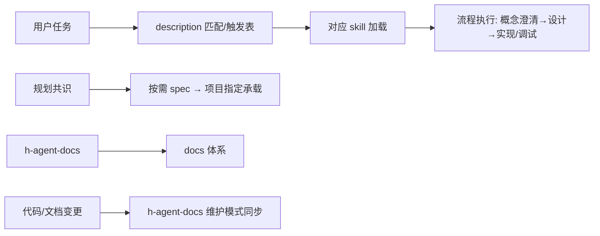

# architecture — skills 仓库

## 架构声明

纯 markdown 仓库（无代码）：`skills/`（六个 skill + references 规范库）+ `global/`（全局规则单源）+ `docs/`（本仓库文档体系）+ `README.md`（安装与使用）。依赖方向：skill 引用 references（philosophy/craft/格式模板）；AGENTS.md §2 导航引用 docs/；全局规则由用户按 coding agent 链接到 global/AGENTS.md。

## 关键数据流

- **skill 触发**：用户任务 → description 自动匹配（或触发表指引）→ skill 加载 → 流程执行
- **增量开发**：概念澄清 → 设计确认 → 按需 spec（项目指定承载）→ 实现（自证 + code-review）→ 验收
- **文档体系**：生成（h-agent-docs）→ 维护（h-agent-docs 维护模式：审查+修复一体）

## 模块导航

| 模块              | 关键文件                                                     | 职责（一句）                                              |
| ----------------- | ------------------------------------------------------------ | --------------------------------------------------------- |
| h-agent-docs      | `skills/h-agent-docs/SKILL.md` + `references/`               | 文档体系生成 + 维护（审查+修复一体）+ 规范库（philosophy/craft/格式模板） |
| h-planning | `skills/h-planning/SKILL.md` | 规划工作流（需求意图/头脑风暴/设计确认→spec 任务） |
| h-implement | `skills/h-implement/SKILL.md` | 实现工作流（按 spec 实现/自证/code-review/验收） |
| h-code-review | `skills/h-code-review/SKILL.md` | 独立代码审查（两轴 + Fowler 坏味道，独立审查者） |
| h-debug           | `skills/h-debug/SKILL.md`                                    | 调试工作流（预期/反馈回路/假设/同意门）                   |
| global            | `global/AGENTS.md`                                           | 全局规则单源（触发表/通用原则，用户按 coding agent 链接） |
| docs              | `docs/CONTEXT.md` `docs/architecture.md`                        | 本仓库文档体系（语义/全览；决策记录按需）                  |

## Skill 开发规范

- **三处一致**：新增/修改 skill 必须同步 SKILL.md frontmatter ↔ README 结构表 ↔ 触发表（global/AGENTS.md）
- **命名**：skill 统一 `h-` 前缀；references 文件名小写连字符
- **流程结构**：命令式流程，非描述性文本——先立心智模型（何时自主推进、何时停下问用户），再给动作步骤；交互是流程内的判断分支（不集中列"停下问的情况"清单，有明确询问点的流程除外，如 h-implement 三类询问点）；不加与流程无关的自我声明（"本 skill 通用"类）
- **提示词写作**：正面为主（反面仅防默认模式/无法正面表达时）；概念先于实现；不过度约束（不堆防御性措辞、多余标注）；无堆料——不重复规则（决策原则一处定义他处引用）、不堆解释、不写论证例子（讨论时的案例不进 skill）；详细≠臃肿（h-implement 457 字节是简洁范例，复杂流程如 h-agent-docs 保持详细但去重）
- **description 设计**：触发优先（何时用 + 一句话做什么）；不塞流程细节/行为规则（流程留 SKILL.md 正文）；选项无编号 bullet（防重排乱序，内部引用用内容描述）
- **Q 编号归属**：Q1-Q3 问询编号/定案细节只 `h-agent-docs`（生成问询主人）使用，其他 skill 写场景级措辞（spec/决策/变更记录"按项目指定方式"，不写 Q 编号）
- **修改后验证**：frontmatter 有效、触发表引用路径存在、README 结构表一致
- **坑：触发描述过期**：description 触发词与流程改名不同步 → 自动匹配失效，改流程时检查 description
- **新增流程**：SKILL.md + references/（按需）→ 三处同步 → 链接到全局（用户操作）

## references 规范

- **分层**：跨语言原则 → `engineering-philosophy.md`；语言落法与坑 → 对应 `*-craft.md`；格式模板 → `SPEC/ADR/CONTEXT/DOCS-FORMAT.md`
- **归属判据**：原则通用放 philosophy，落法与坑按语言/框架进 craft，模板进格式文件
- **哲学消费方**：注入项目 AGENTS.md §1 硬规则（注入清单取条目，即项目 Code style guidelines，执行级强制）+ 五 skill 流程内 consult（规划/实现/调试/审查时对照哲学与对应语言 craft，触发时读，路径见 skill 流程与项目 AGENTS.md「完整规范」）；craft 由 h-agent-docs 生成时按项目语言取对应规范
- **坑（历史踩坑）**：Qt QSS 纪律误入 philosophy（框架特定，已移 python-craft）；断言收窄一度写成通用实践（动态语言落法，已移）；Rust 术语泄漏（assert/dict 等已在通用层中立化）；外部 skill 依赖（ADR 曾引用 grill-with-docs，已内置自包含）

## 演进方向（按需）

（暂无明确路线，出现时按需补充）
