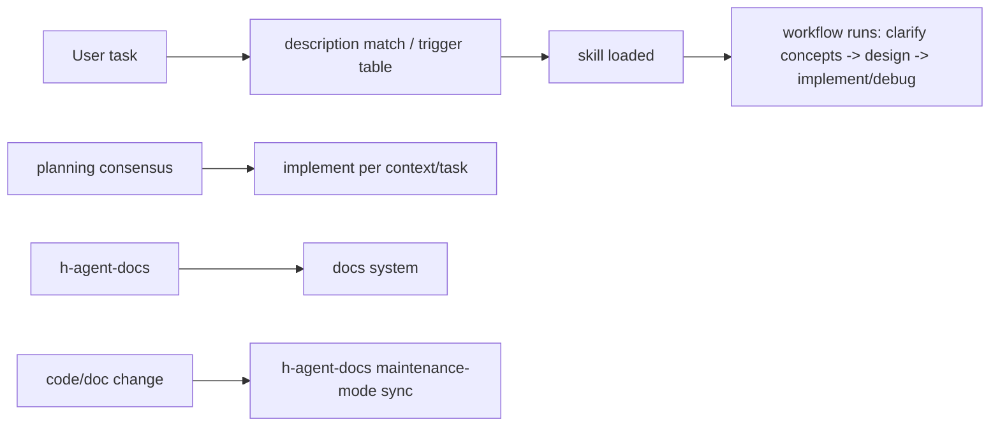

# architecture — skills repo

## Architecture Statement

A pure markdown repo (no code): `skills/` (seven skills + references convention library) + `global/` (single source of truth for global rules) + `docs/` (this repo's documentation system) + `README.md` (installation and usage). Dependency direction: skills reference references (philosophy/craft/format templates); AGENTS.md §2 navigation references docs/; global rules are linked to global/AGENTS.md by the user per coding agent.

## Key Data Flows

- **Skill triggering**: user task → automatic description matching (or trigger table guidance) → skill loaded → workflow executed
- **Incremental development**: clarify concepts → confirm design → implement (self-verification + code-review) → acceptance
- **Documentation system**: generation (h-agent-docs) → maintenance (h-agent-docs maintenance mode: review and repair in one)

## Module Navigation

| Module            | Key files                                                    | Responsibility (one line)                                     |
| ----------------- | ------------------------------------------------------------ | ------------------------------------------------------------- |
| h-agent-docs      | `skills/h-agent-docs/SKILL.md` + `references/`               | Documentation system generation + maintenance (drift repair) + rewrite (wholesale rewrite to a good state) + convention library (philosophy/craft/format templates) |
| h-commit          | `skills/h-commit/SKILL.md`                                   | Commit workflow (infer changes from diffs of historical commits, write commit messages) |
| h-planning        | `skills/h-planning/SKILL.md`                                 | Planning workflow (requirement intent/brainstorming/design confirmation → convergent decision) |
| h-implement       | `skills/h-implement/SKILL.md`                                | Implementation workflow (implement per context/self-verification/code-review/acceptance) |
| h-code-review     | `skills/h-code-review/SKILL.md`                              | Standalone code review (two axes + Fowler code smells, independent reviewer) |
| h-debug           | `skills/h-debug/SKILL.md`                                    | Debugging workflow (expectations/feedback loop/hypothesis/approval gate) |
| h-research        | `skills/h-research/SKILL.md`                                 | Topic research (background delegation + primary sources + references persisted to docs/research/) |
| global            | `global/AGENTS.md`                                           | Single source of truth for global rules (general principles, linked by the user per coding agent) |
| docs              | `docs/CONTEXT.md` `docs/architecture.md`                     | This repo's documentation system (semantics/overview; decision records as needed) |

## Skill Development Conventions

- **Three-way consistency**: new/modified skills must keep SKILL.md frontmatter ↔ README structure table ↔ trigger table (this repo's AGENTS.md) in sync
- **Naming**: skills uniformly use the `h-` prefix; references file names use lowercase hyphens
- **Q-number ownership**: Q1-Q3 query numbers/finalization details are used only by `h-agent-docs` (owner of generation queries); other skills write scenario-level wording (decision/change records "in the project-specified manner", without Q numbers)
- **Verify after changes**: frontmatter valid, trigger table referenced paths exist, README structure table consistent
- **Pitfall: stale trigger descriptions**: description trigger words not synced with workflow renames → automatic matching breaks; check description when changing workflows
- **Adding a workflow**: SKILL.md + references/ (as needed) → three-way sync → link to global (user action)

## references Conventions

- **Layering**: cross-language principles → `engineering-philosophy.md`; language implementations and pitfalls → corresponding `*-craft.md`; format templates → `AGENTS/ADR/CONTEXT/DOCS-FORMAT.md`
- **Placement criteria**: general principles go to philosophy; implementations and pitfalls go to craft by language/framework; templates go to format files
- **Philosophy consumers**: injected into the project AGENTS.md Code style section (entries taken from the injection checklist, enforced at execution level) + consulted within the five-skill workflows (planning/implementation/debugging/review compare against philosophy and the corresponding language craft, read when triggered); craft conventions are selected per project language when generated by h-agent-docs
- **Pitfalls (historical)**: Qt QSS discipline wrongly ended up in philosophy (framework-specific, moved to python-craft); assertion narrowing was once written as a general practice (dynamic-language implementation, moved); Rust terminology leaked (assert/dict etc. neutralized at the general layer); external skill dependency (ADR once referenced grill-with-docs, now built in self-contained)

## Evolution Directions (As Needed)

(No definite roadmap yet; add as needs arise.)